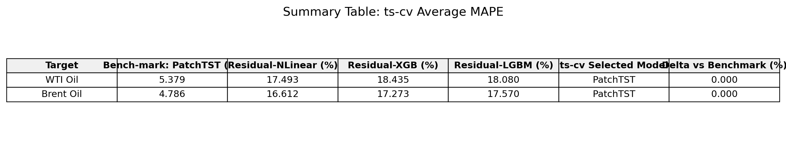
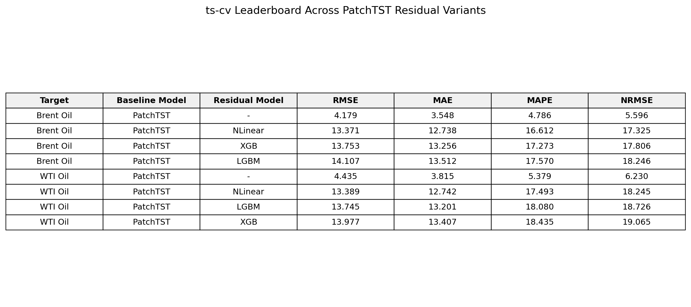
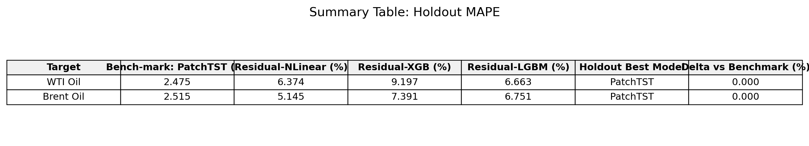
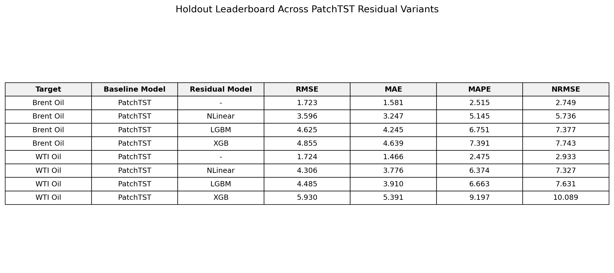
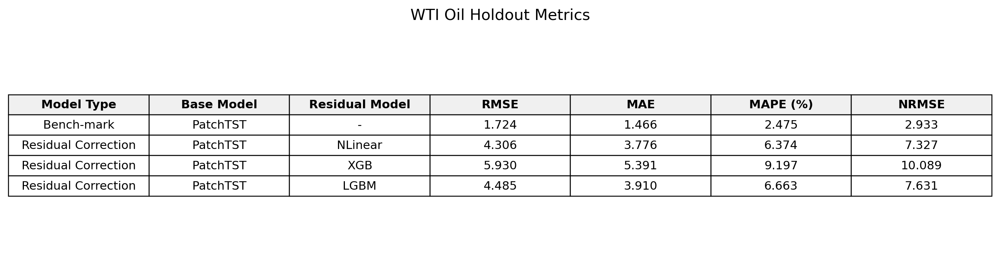
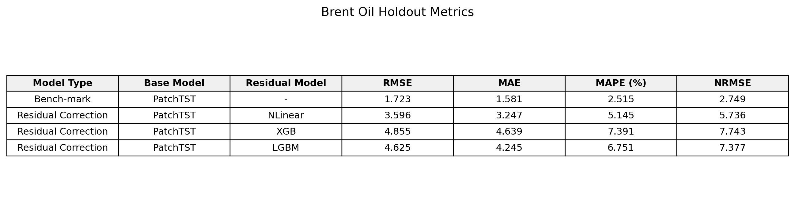
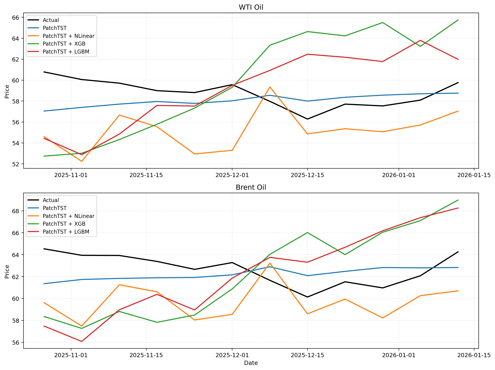

# 01. 핵심쟁점

---

- “기본모델(Bench-mark)”인 `PatchTST`와 residual 보정모델(`NLinear`, `XGB`, `LGBM`)을 비교했을 때, 예측 성능 향상이 있는지 확인한다.
- 본 strict 기준본에서는 별도의 독립 실험모델을 채택하지 않았으므로, 템플릿의 `실험모델` 칸은 `-`로 표기하고 residual 보정모델의 추가 효과만 비교한다.
- 성능 비교는 `RMSE`, `MAE`, `MAPE`, `NRMSE` 기준으로 수행한다.

# 02. 데이터 및 모델 세팅

---

- **예측 타깃**
  - `WTI Oil` (`Com_CrudeOil`)
  - `Brent Oil` (`Com_BrentCrudeOil`)
- **예측 단위**
  - 주간 예측
- **데이터 구간 세팅**
  - TrainSet 기간: `2013-04-01 ~ 2023-10-23` (총 `552주`)
  - ValidationSet 기간: `2023-10-30 ~ 2025-10-20` (총 `24개 fold`, 실질 평가영역 `104주`)
    - Cross-Validation Fold 1: `2023-10-30 ~ 2024-01-15` (총 `12주`)
    - Cross-Validation Fold 2: `2023-11-27 ~ 2024-02-12` (총 `12주`)
    - Cross-Validation Fold 3: `2023-12-25 ~ 2024-03-11` (총 `12주`)
    - ...
    - Cross-Validation Fold 24: `2025-08-04 ~ 2025-10-20` (총 `12주`)
  - TestSet 기간: `2025-10-27 ~ 2026-01-12` (총 `12주`)
  - 전체 데이터 구간: `2013-04-01 ~ 2026-01-12` (총 `668주`)
  - 최근 평가영역 길이: `116주 = 104주(ts-cv) + 12주(holdout) = 52*2 + 12`
- **피처리스트**
  - 기본모델
    - 외생변수 없음
    - 각 타깃은 별도의 단변량 시계열로 구성되며, 최근 `48주` 값만 입력으로 사용
  - 실험모델
    - `-`
    - 본 strict 기준본에서는 별도의 독립 실험모델을 포함하지 않음
  - Residual 보정모델
    - train 내부 calibration tail에서 생성한 `out-of-sample residual series`의 최근 `48주` residual만 입력으로 사용
- **공통 설정**

```python
common_config = {
    "horizon": 12,
    "step_size": 4,
    "number_of_windows": 24,
    "final_holdout": 12,
    "input_size": 48,
    "season_length": 52,
}
```

- **모델 세팅**
  - 기본모델 `PatchTST`

```python
patchtst_params = {
    "hidden_size": 128,
    "attention_heads": 16,
    "linear_hidden_size": 256,
    "patch_len": 16,
    "stride": 8,
    "dropout": 0.2,
    "encoder_layers": 3,
    "attn_dropout": 0.0,
    "fc_dropout": 0.2,
    "max_steps": 5000,
    "learning_rate": 0.0001,
    "scaler_type": "identity",
}
```

  - 실험모델 `-`

```python
# strict 기준본에서는 별도 독립 실험모델 없음
params = {}
```

  - Residual 보정모델
    - `NLinear`
    - `XGB`
    - `LGBM`

```python
residual_params = {
    "NLinear": {
        "learning_rate": 0.001,
        "max_steps": 2000,
        "batch_size": 32,
    },
    "XGB": {
        "n_estimators": 400,
        "learning_rate": 0.03,
    },
    "LGBM": {
        "n_estimators": 400,
        "learning_rate": 0.03,
    },
}
```

- **지표 정의**
  - `RMSE`, `MAE`, `MAPE`는 일반적인 정의를 사용하였다.
  - `NRMSE`는 `RMSE / abs(mean(y_true)) * 100`으로 계산하였다.

# 03. 실험 설계 및 적용

---

- 기본모델 `PatchTST`를 먼저 학습하고, 동일한 Train/Validation/Test 프로토콜 안에서 residual 보정모델을 추가 적용하였다.
- 본 strict 기준본에서는 별도의 독립 실험모델을 두지 않았으므로, residual 보정모델은 모두 `PatchTST` baseline 위에만 결합하였다.
- residual 보정모델은 train 내부 calibration tail에서 생성한 `out-of-sample residual series`를 입력으로 받아 `48 -> 12` direct residual forecast를 수행하였다.
- calibration residual 생성에는 학습 window의 마지막 `104개` supervised windows를 사용했다.
- 코드 점검 후 calibration model 학습 window에 `horizon-1` embargo를 추가하여, calibration target 구간이 학습 label에 겹치지 않도록 수정하였다.
- 최종 비교군은 아래 네 종류로 구성하였다.
  - Bench-mark: `PatchTST`
  - Experimental: `-`
  - Residual Correction: `PatchTST + NLinear`
  - Residual Correction: `PatchTST + XGB`
  - Residual Correction: `PatchTST + LGBM`
- ValidationSet에서는 fold 평균 성능으로 모델을 해석하고, TestSet은 최종 성능 보고에만 사용하였다.
- holdout 기준 residual series 길이는 `115`, residual supervised sample 수는 `56`이다.
- 본 보고서의 결과표에는 strict 단변량 프로토콜에서 재현된 수치만 사용하고, exploratory 다변량·외생변수 결과는 포함하지 않았다.

# 04. 실험(모델링) 결과

### 04-01. 결과 요약 (MAPE 기준)

---

| Target | Bench-mark (%) | 실험모델 (%) | Residual-NLinear (%) | Residual-XGB (%) | Residual-LGBM (%) | Bench-mark 대비 최종 증감 (%) |
| --- | ---: | ---: | ---: | ---: | ---: | ---: |
| WTI Oil | 5.379 | - | 17.493 | 18.435 | 18.080 | 0.000 |
| Brent Oil | 4.786 | - | 16.612 | 17.273 | 17.570 | 0.000 |

- 최종 채택 모델은 두 타깃 모두 `Bench-mark(PatchTST)`였다.
- 마지막 열은 최종 채택 모델의 `MAPE - Bench-mark MAPE`로 계산하였다.



#### 핵심 Leaderboard (ts-cv 평균)

| Target | Baseline Model | Residual Model | RMSE | MAE | MAPE | NRMSE |
| --- | --- | --- | ---: | ---: | ---: | ---: |
| WTI Oil | PatchTST | - | 4.435 | 3.815 | 5.379 | 6.230 |
| WTI Oil | PatchTST | NLinear | 13.389 | 12.742 | 17.493 | 18.245 |
| WTI Oil | PatchTST | XGB | 13.977 | 13.407 | 18.435 | 19.065 |
| WTI Oil | PatchTST | LGBM | 13.745 | 13.201 | 18.080 | 18.726 |
| Brent Oil | PatchTST | - | 4.179 | 3.548 | 4.786 | 5.596 |
| Brent Oil | PatchTST | NLinear | 13.371 | 12.738 | 16.612 | 17.325 |
| Brent Oil | PatchTST | XGB | 13.753 | 13.256 | 17.273 | 17.806 |
| Brent Oil | PatchTST | LGBM | 14.107 | 13.512 | 17.570 | 18.246 |



#### 핵심 Leaderboard (holdout)

| Target | Baseline Model | Residual Model | RMSE | MAE | MAPE | NRMSE |
| --- | --- | --- | ---: | ---: | ---: | ---: |
| WTI Oil | PatchTST | - | 1.724 | 1.466 | 2.475 | 2.933 |
| WTI Oil | PatchTST | NLinear | 4.306 | 3.776 | 6.374 | 7.327 |
| WTI Oil | PatchTST | XGB | 5.930 | 5.391 | 9.197 | 10.089 |
| WTI Oil | PatchTST | LGBM | 4.485 | 3.910 | 6.663 | 7.631 |
| Brent Oil | PatchTST | - | 1.723 | 1.581 | 2.515 | 2.749 |
| Brent Oil | PatchTST | NLinear | 3.596 | 3.247 | 5.145 | 5.736 |
| Brent Oil | PatchTST | XGB | 4.855 | 4.639 | 7.391 | 7.743 |
| Brent Oil | PatchTST | LGBM | 4.625 | 4.245 | 6.751 | 7.377 |





### 04-02. 세부 결과

---

- **Test Set Metric**
  - TestSet 기간: `2025-10-27 ~ 2026-01-12` (총 `12주`)

#### WTI Oil

| Model Type | Base Model | Residual Model | RMSE | MAE | MAPE (%) | NRMSE |
| --- | --- | --- | ---: | ---: | ---: | ---: |
| Bench-mark | PatchTST | - | 1.724 | 1.466 | 2.475 | 2.933 |
| Experimental | - | - | - | - | - | - |
| Residual Correction | PatchTST | NLinear | 4.306 | 3.776 | 6.374 | 7.327 |
| Residual Correction | PatchTST | XGB | 5.930 | 5.391 | 9.197 | 10.089 |
| Residual Correction | PatchTST | LGBM | 4.485 | 3.910 | 6.663 | 7.631 |



#### Brent Oil

| Model Type | Base Model | Residual Model | RMSE | MAE | MAPE (%) | NRMSE |
| --- | --- | --- | ---: | ---: | ---: | ---: |
| Bench-mark | PatchTST | - | 1.723 | 1.581 | 2.515 | 2.749 |
| Experimental | - | - | - | - | - | - |
| Residual Correction | PatchTST | NLinear | 3.596 | 3.247 | 5.145 | 5.736 |
| Residual Correction | PatchTST | XGB | 4.855 | 4.639 | 7.391 | 7.743 |
| Residual Correction | PatchTST | LGBM | 4.625 | 4.245 | 6.751 | 7.377 |



- **ts-cv leaderboard 표**
  - 아래 표는 논문/보고서용 메인 표로 사용한다.
  - `Target`, `Base Model`, `Residual Model`, `RMSE`, `MAE`, `MAPE`, `NRMSE` 순으로 정렬한다.

| Target | Base Model | Residual Model | RMSE | MAE | MAPE | NRMSE |
| --- | --- | --- | ---: | ---: | ---: | ---: |
| WTI Oil | PatchTST | - | 4.435 | 3.815 | 5.379 | 6.230 |
| WTI Oil | PatchTST | NLinear | 13.389 | 12.742 | 17.493 | 18.245 |
| WTI Oil | PatchTST | XGB | 13.977 | 13.407 | 18.435 | 19.065 |
| WTI Oil | PatchTST | LGBM | 13.745 | 13.201 | 18.080 | 18.726 |
| Brent Oil | PatchTST | - | 4.179 | 3.548 | 4.786 | 5.596 |
| Brent Oil | PatchTST | NLinear | 13.371 | 12.738 | 16.612 | 17.325 |
| Brent Oil | PatchTST | XGB | 13.753 | 13.256 | 17.273 | 17.806 |
| Brent Oil | PatchTST | LGBM | 14.107 | 13.512 | 17.570 | 18.246 |


- **Plot**
  - TestSet 실제값과 각 모델의 예측값을 비교한 그림이다.
  - `Bench-mark`와 `Residual Correction` 모델을 모두 포함하였다.



# 05. 결론 및 얻게 된 인사이트

---

- strict 기준본에서는 `WTI Oil`, `Brent Oil` 모두에서 `PatchTST`가 `RMSE`, `MAE`, `MAPE`, `NRMSE` 기준 최저오차를 기록했다.
- 코드 감사로 calibration residual leakage를 제거한 뒤, residual 보정모델(`NLinear`, `XGB`, `LGBM`)의 성능은 이전보다 더 악화되었고 `ts-cv 평균`과 `holdout` 모두에서 `PatchTST`를 이기지 못했다.
- 따라서 현재 채택 가능한 결론은 `PatchTST` 단독 모델이며, residual correction은 수정된 strict 구현에서도 신뢰 가능한 추가 성능 향상을 재현하지 못했다.

# 06. 향후 Action Plan

---

- strict 기준본은 `PatchTST` 단독 모델로 유지한다.
- residual correction을 다시 시험하려면 더 긴 `out-of-sample residual` 학습 표본을 확보하는 방식으로 재설계한다.
- 다변량·외생변수 결과는 strict `48 -> 12 direct` 구조로 별도 재구성한 뒤 후속 보고서로 분리한다.
